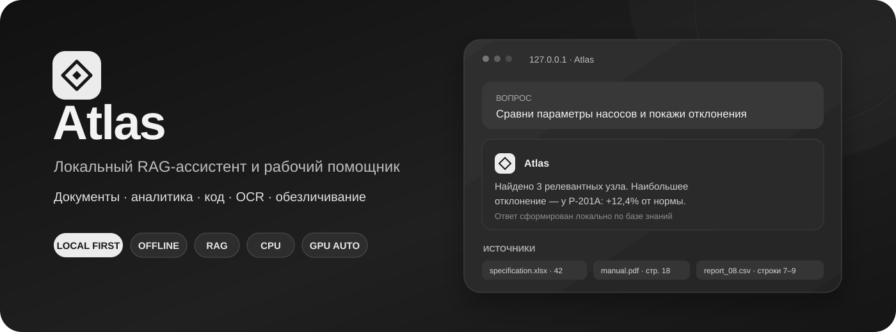
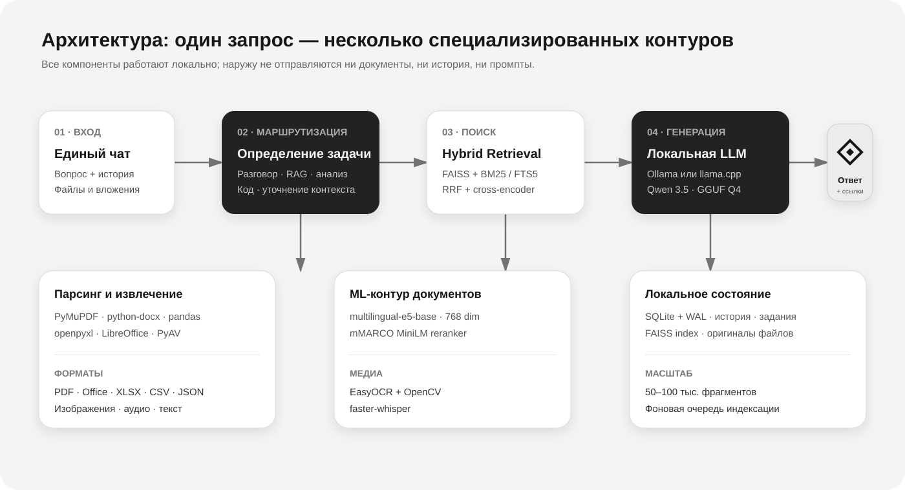
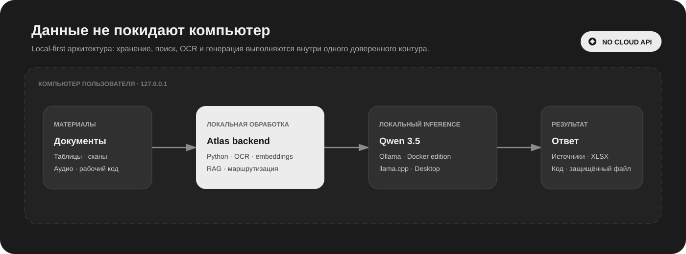

# Atlas

<p align="center">
  
</p>

<p align="center">
  <a href="https://github.com/asg-55/atlas-local-rag/actions/workflows/docker.yml"></a>
  
  
  
  
  <a href="LICENSE"></a>
</p>

<p align="center">
  <b>Локальный ИИ-ассистент для инженерных документов, корпоративной базы знаний, анализа данных, OCR и рабочего кода.</b><br>
  Atlas превращает разрозненные файлы в проверяемый диалог с источниками — без обязательных облачных API и передачи рабочих данных третьим сторонам.
</p>

---

## Зачем нужен Atlas

Обычная LLM знает общие сведения, но не знает локальные регламенты, паспорта оборудования, отчёты и таблицы организации. Atlas добавляет к локальной модели управляемый контур документов: сохраняет материалы, индексирует их, находит релевантные фрагменты и формирует ответ со ссылками на первоисточник.

| Рабочая задача | Что делает Atlas |
|---|---|
| **Найти сведения в документах** | Ищет одновременно по смыслу и точным словам, объединяет и переранжирует результаты. |
| **Разобрать таблицу или выгрузку** | Показывает структуру, пропуски, диапазоны, средние, частые значения и релевантные строки. |
| **Обсудить или создать код** | Работает с VBA, Python и C#, сохраняет контекст обсуждения и отдельно проверяет созданный код. |
| **Оцифровать сканы и отчёты** | Выполняет OCR, восстанавливает табличную сетку и экспортирует проверяемый XLSX. |
| **Подготовить файл для внешней обработки** | Обратимо обезличивает Office, EML и текстовые форматы с отдельным зашифрованным ключом. |
| **Работать с закрытыми данными** | Хранит файлы, историю, индексы и модели локально; после подготовки Desktop работает офлайн. |

## Что умеет

- единый чат для обычных вопросов, RAG, анализа вложений, создания и обсуждения кода;
- PDF, DOC, DOCX, XLSX, CSV, JSON, TXT, Markdown, изображения и аудио;
- постоянная база знаний и временные вложения диалога без добавления в RAG;
- multilingual embeddings + BM25/SQLite FTS5 + Reciprocal Rank Fusion + cross-encoder reranker;
- база примерно до 50–100 тысяч фрагментов без загрузки всего текста в RAM;
- русский и английский OCR через EasyOCR и OpenCV, локальная транскрибация через faster-whisper;
- фоновая последовательная индексация файлов и устойчивые OCR-задания;
- специализированное извлечение производственных отчётов BCNX-A10 в Excel;
- обратимое обезличивание DOCX, XLSX, PPTX, EML, CSV, TXT, JSON и MD;
- Docker-редакция с Ollama и отдельная переносимая Windows-редакция на llama.cpp;
- локальное хранение в SQLite, журналирование, диагностика и автоматическая сборка образа в GitHub Actions.

## Как работает запрос

1. Маршрутизатор учитывает новое сообщение, историю и вложения и определяет тип задачи.
2. Для документного вопроса Atlas формирует самостоятельный поисковый запрос.
3. Dense-поиск в FAISS и lexical-поиск BM25/FTS5 создают независимые списки кандидатов.
4. Reciprocal Rank Fusion объединяет списки, затем cross-encoder повторно оценивает лучшие фрагменты.
5. Найденный контекст, история и инструкция передаются локальной LLM.
6. Пользователь получает единый ответ, источники и может продолжить обсуждение в том же диалоге.

Числовая аналитика, структура таблиц и специализированные производственные формы обрабатываются программно. LLM объясняет результат, но не подменяет собой вычисления и не угадывает расположение полей отчёта.

<p align="center">
  
</p>

## Технический профиль

| Слой | Реализация |
|---|---|
| **Язык и UI** | Python 3.11, Streamlit 1.46 |
| **LLM transport** | Ollama в Docker-редакции; OpenAI-совместимый `llama-server`/llama.cpp в Desktop |
| **Основные модели** | Qwen 3.5 9B в текущем Docker-профиле; Qwen 3.5 4B GGUF Q4_K_M в первом Desktop-комплекте |
| **Embeddings** | `intfloat/multilingual-e5-base`, dense-векторы размерности 768 |
| **Retrieval** | FAISS IndexFlatIP + BM25 или SQLite FTS5 + RRF |
| **Reranking** | `cross-encoder/mmarco-mMiniLMv2-L12-H384-v1` |
| **Хранилище** | SQLite/WAL, FTS5, файловое хранилище оригиналов, FAISS index |
| **Документы** | PyMuPDF, python-docx, openpyxl, pandas, lxml, portable/system LibreOffice |
| **OCR и аудио** | EasyOCR, OpenCV, Pillow, faster-whisper, PyAV |
| **Безопасность** | localhost bind, опциональный пароль UI, случайный API-ключ llama-server, offline-флаги Hugging Face |
| **Поставка** | Docker Compose/GHCR или per-user Windows installer на Inno Setup 7 |
| **GPU/CPU** | CPU обязателен; Desktop автоматически пробует Vulkan и откатывается на CPU |

<p align="center">
  
</p>

## Две независимые редакции

| | Docker edition | Atlas Desktop |
|---|---|---|
| **Назначение** | Разработка, личная рабочая установка, сервер | Установка коллегой почти как обычной Windows-программы |
| **LLM** | Локальная Ollama, по умолчанию `qwen3.5:9b` | Встроенный llama.cpp и Qwen 3.5 4B Q4_K_M |
| **Зависимости** | Docker Desktop + Ollama | Всё включено: Python, GGUF, llama.cpp, ML-модели и LibreOffice |
| **Ускорение** | Определяется Ollama | Vulkan при наличии, автоматический CPU fallback |
| **Данные** | `data/` и `model_cache/` проекта | `%LOCALAPPDATA%\Atlas`, отдельно от каталога приложения |
| **Статус** | Основной рабочий контур | Проверенный технический прототип; публичный EXE пока не подписан |

Desktop не маскирует Docker или Ollama внутри установщика. Это отдельная нативная схема запуска с упакованным Python и llama.cpp. Подробности, состав дистрибутива и результаты измерений находятся в [`desktop/README.md`](desktop/README.md) и [`docs/windows-portable-audit.md`](docs/windows-portable-audit.md).

## Быстрый запуск Docker edition на Windows

Понадобятся [Docker Desktop](https://www.docker.com/products/docker-desktop/) и [Ollama](https://ollama.com/download).

```powershell
git clone https://github.com/asg-55/atlas-local-rag.git
cd atlas-local-rag
ollama pull qwen3.5:9b
Copy-Item .env.example .env
docker compose up -d --build
```

Откройте <http://127.0.0.1:8501>. При первой индексации Atlas загрузит модели embeddings, reranker и EasyOCR в `model_cache/`; повторная загрузка при следующем запуске не потребуется.

Для компьютера с меньшим объёмом памяти можно выбрать другую локальную instruct-модель в `.env`. Реальная скорость зависит от CPU, GPU, доступной памяти, длины контекста и формата документов.

## Структура проекта

```text
app.py                       Streamlit-интерфейс и маршрутизация UI
rag_assistant/               RAG, парсеры, OCR, LLM-клиенты и бизнес-логика
desktop/                     независимый Windows runtime и installer
scripts/                     диагностика, benchmarks и интеграционные проверки
tests/                       unit- и регрессионные тесты
data/                        локальные документы, SQLite и индексы — не в Git
model_cache/                 локальные ML-модели — не в Git
compose.yaml                 основной Docker-контур
Dockerfile                   runtime- и test-образы
.github/workflows/docker.yml CI, тестирование и публикация GHCR
```

## Конфигурация

| Переменная | Значение по умолчанию | Назначение |
|---|---:|---|
| `APP_PORT` | `8501` | Порт интерфейса |
| `HOST_BIND` | `127.0.0.1` | Локальный bind; для доверенной LAN можно задать `0.0.0.0` |
| `APP_PASSWORD` | пусто | Пароль интерфейса; обязателен для удалённого доступа |
| `LLM_BACKEND` | `ollama` | LLM-транспорт: `ollama` или `llama_cpp` |
| `OLLAMA_BASE_URL` | `http://host.docker.internal:11434` | Ollama, доступная из контейнера |
| `LLAMA_BASE_URL` | `http://host.docker.internal:8080` | OpenAI-совместимый API локального llama-server |
| `CHAT_MODEL` | `qwen3.5:9b` | Модель ответа по умолчанию |
| `EMBEDDING_MODEL` | `intfloat/multilingual-e5-base` | Модель dense-поиска |
| `RERANKER_MODEL` | `cross-encoder/mmarco-mMiniLMv2-L12-H384-v1` | Финальное ранжирование кандидатов |
| `ENABLE_RERANKER` | `true` | Позволяет отключить reranker на слабом CPU |
| `MIN_RELEVANCE` | `0.08` | Минимальная итоговая релевантность |
| `DENSE_CANDIDATES` | `40` | Базовое число кандидатов смыслового поиска |
| `LEXICAL_CANDIDATES` | `40` | Базовое число кандидатов лексического поиска |
| `MAX_SEARCH_CANDIDATES` | `120` | Верхняя граница адаптивного пула каждого поискового канала |
| `MAX_RERANK_CANDIDATES` | `100` | Максимум фрагментов для финального reranker |
| `BM25_MEMORY_THRESHOLD` | `20000` | Порог перехода лексического поиска на SQLite FTS5 |
| `OCR_PDF_MODE` | `auto` | `auto`, `always` или `off` для обычных PDF |
| `OCR_DPI` | `220` | Разрешение обычного OCR; модуль отчётов выбирает DPI в UI |
| `ASSISTANT_IMAGE` | `atlas-local-rag:latest` | Готовый Docker-образ вместо локальной сборки |
| `DOMAIN` | `knowledge.example.com` | Домен HTTPS-профиля Caddy |

`.env`, пользовательские документы, база данных, ключи обезличивания и кэш моделей исключены из Git.

### Масштабирование базы знаний

Atlas сохраняет точный FAISS-поиск по всему векторному индексу. До 20 000 фрагментов лексический BM25 работает по прежней схеме в памяти, поэтому качество существующих небольших баз не меняется. После порога Atlas автоматически переключает лексический канал на дисковый SQLite FTS5, чтобы рост библиотеки не приводил к загрузке всего текста и токенов в оперативную память.

Пул кандидатов также увеличивается автоматически: 40+40 до 10 000 фрагментов, 80+80 до 50 000 и 120+120 выше 50 000. Лучшие кандидаты объединяются через RRF и проходят reranker. Векторный индекс при добавлении документов дополняется новыми embeddings; полное перестроение требуется только после удаления документов или при несовместимой метаинформации индекса.

Текущий режим и фактическое число кандидатов отображаются во вкладке `Диагностика`. Значения рассчитаны на локальную базу до 100 000 фрагментов и при необходимости переопределяются через `.env`.

Быструю проверку дискового индекса на синтетической базе можно запустить командой `docker compose exec assistant python scripts/benchmark_search_scale.py --chunks 50000`.

### Качество ответов и лимиты

Atlas отдельно настраивает общий контекст модели и максимальную длину ответа. Контекст включает системную инструкцию, историю диалога, найденные фрагменты и будущий ответ, поэтому эти два значения нельзя считать независимыми.

- для `qwen2.5:7b` доступен контекст до 32К токенов;
- для `qwen3.5:9b` Atlas разрешает контекст до 64К и ответ до 32К токенов;
- большой максимум не заставляет модель писать весь объём, но увеличивает допустимую длину;
- при выделении половины контекста под ответ Atlas предупреждает, что для источников останется меньше места.

Перед ответом Atlas определяет задачу: обычный разговор, поиск по базе, анализ данных, создание или обсуждение кода. Для поиска он исправляет неточную формулировку, восстанавливает смысл по истории и формирует самостоятельный запрос. Если без выбора объекта, периода или результата возможны существенно разные ответы, ассистент сначала задаёт один уточняющий вопрос. Пользователю не требуется самостоятельно составлять профессиональный промпт.

### Вложения без добавления в RAG

Файл можно прикрепить непосредственно в поле сообщения. Atlas сохранит его только внутри текущего диалога, извлечёт текст обычным парсером и передаст модели напрямую. Такой файл не появляется во вкладке `Файлы`, не получает embeddings и не добавляется в векторный или BM25-индекс.

Вложения остаются доступны для следующих вопросов этого диалога и после перезапуска приложения. В режиме `Автоматически` Atlas сам решает, нужен ли дополнительно поиск в постоянной базе; старое вложение само по себе не включает глобальный RAG после смены темы. Режимы `Только документы` и `Без базы знаний` позволяют явно зафиксировать поведение. Удаление диалога удаляет и его вложения.

Для XLSX, CSV и JSON Atlas заранее определяет столбцы и число строк, считает пропуски, минимум, максимум, среднее и частые текстовые значения. Эта сводка охватывает весь файл и всегда сохраняется в контексте; модель использует её для выводов, а релевантные исходные строки — для детализации. Достаточно прикрепить файл в общий чат и описать задачу обычными словами.

История открывается отдельной кнопкой в боковой панели и поддерживает поиск, переключение, переименование и подтверждаемое удаление. Редко используемые параметры модели находятся в `Технических параметрах`, а основные режимы ответа — в сворачиваемом блоке `Ответ и качество`.

Файлы из раздела `База знаний` индексируются в отдельной однопоточной очереди. После нажатия `Добавить в библиотеку` можно перейти в чат или другой раздел: обработка не привязана к текущему запуску страницы, а при возвращении Atlas покажет результат. Однопоточный режим намеренно ограничивает одновременное потребление RAM моделями embeddings и OCR.

Каждый новый вопрос сохраняется со статусом формирования ответа. Если локальная модель, Streamlit или соединение с вкладкой прерываются, Atlas не теряет вопрос и не скрывает ошибку после обновления страницы: в диалоге остаётся понятное уведомление, техническая причина и кнопка `Повторить ответ`. Повтор использует тот же ход без создания дубликата пользовательского сообщения.

### Рабочий код

Работа с кодом встроена в общий чат. По запросу на создание или существенное изменение Atlas возвращает полный самодостаточный VBA, Python или C# в стандартном Markdown-блоке и выполняет отдельный проход проверки. Последующие вопросы вроде «почему здесь ошибка?» или «что делает эта строка?» переводятся в режим обсуждения: Atlas использует предыдущий код и не генерирует всё решение заново. Если локально установлена `qwen2.5-coder:7b`, она автоматически используется для создания и обсуждения кода; иначе остаётся выбранная общая модель. Встроенного редактора, терминала и автоматического выполнения нет.

Контекст и максимальная длина ответа ограничиваются возможностями модели, которая фактически формирует ответ. Поэтому параметры, допустимые для общей модели, не передаются coder-модели сверх её собственного предела. Если coder-модель всё же отклоняет запрос, Atlas один раз повторяет тот же ход на выбранной общей модели; содержательная причина отказа Ollama сохраняется в состоянии сообщения, если fallback также не сработал.

Вопросы вида «как усилить или улучшить этот код?» также считаются обсуждением. Atlas сначала выдаёт приоритетный список улучшений с пользой и рисками и предлагает выбрать вариант; изменённый полный листинг появляется только после явной просьбы переписать или доработать код.

На вопрос «что изменилось в коде?» Atlas сравнивает два последних показанных варианта, перечисляет только фактические отличия и отдельно отмечает ранее предложенные, но ещё не реализованные улучшения.

Ответ с рекомендациями дополнительно проверяется после генерации: если coder-модель всё же добавила полный блок кода без явной просьбы, Atlas один раз переписывает ответ и удаляет оставшиеся fenced-блоки. Обычный чат не добавляет служебные разделы об устройстве ответа, а строгий RAG при полном отсутствии искомого факта отвечает коротко, не пересказывая нерелевантный источник.

### Обратимое обезличивание

Во вкладке `Обезличивание` Atlas работает отдельно от RAG и Ollama. Поддерживаются современные форматы Word (`DOCX`), Excel (`XLSX`), PowerPoint (`PPTX`), сохраненные из Outlook письма (`EML`), а также `CSV`, `TXT`, `JSON` и Markdown (`MD`). Форматирование Office сохраняется: Atlas заменяет текст внутри исходного OOXML-пакета, а не пересобирает документ с нуля. Для текстовых файлов сохраняются исходная кодировка (UTF-8, UTF-16 или Windows-1251), BOM, переносы строк и структура; в EML обрабатываются заголовки, текст письма и вложенные DOCX/XLSX/PPTX.

Сначала Atlas показывает найденные ФИО, адреса, телефоны, электронную почту, реквизиты и другие значения. Перед обработкой список можно проверить, снять отдельные флажки и добавить собственные значения. Затем создаются:

- обезличенная копия с метками вида `ATLAS-PERSON-0001` и техническими адресами домена `anonymous.invalid`;
- отдельный файл `*.atlas-key.json`, в котором таблица соответствий зашифрована паролем;
- при желании ZIP с обоими файлами.

Для обратного преобразования нужны обезличенный документ, соответствующий ключ и пароль. Пароль не хранится, поэтому его утрата делает восстановление невозможным. Atlas не сохраняет результаты обезличивания на диск: документ, ключ, ZIP-комплект и восстановленный файл нужно скачать из браузера до обновления страницы.

Ключ Atlas не привязан к расширению результата, а содержит соответствия обезличенных меток. Поэтому обезличенный `XLSX` можно обработать внешним сервисом, получить готовый отчёт в `DOCX`, `PPTX`, `CSV`, `TXT`, `JSON`, `MD` или другом поддерживаемом формате и применить к нему исходный ключ. Atlas восстановит все сохранившиеся метки, а имя скачиваемого файла сформирует из имени фактически загруженного отчёта. Если выбран неверный ключ, соответствующие метки не будут найдены и файл не будет создан.

Старые бинарные DOC/XLS/PPT и Outlook MSG в первой версии не изменяются: сначала сохраните их как DOCX/XLSX/PPTX или EML. Это ограничение защищает структуру документа от необратимой порчи. Автоматический поиск следует считать помощником, а не гарантией обнаружения всех персональных данных — перед передачей файла всегда просматривайте итоговый список и обезличенную копию.

Для производственных XLSX-выгрузок Atlas автоматически распознаёт обозначения вида `FIC-1025`, `P-201A`, `D228`, `УПП-2` по всей книге и анализирует заголовки таблиц. Для полной замены автоматически предлагаются объектные столбцы `Тег`, `Узел`, `Оборудование`, `Позиция`, `Установка` и похожие. Колонки `Наименование параметра`, `Описание сигнала`, числовые значения, формулы, даты и единицы измерения не выбираются: внутри них заменяются только уже найденные названия объектов и теги, а полезный смысл параметра сохраняется.

## OCR и извлечение таблиц

Обычные сканированные PDF обрабатываются автоматически, если у страницы нет пригодного текстового слоя. EasyOCR распознает текст, а OpenCV восстанавливает строки и колонки таблиц по геометрии сетки.

Для архива сканов можно включить принудительный режим:

```env
OCR_PDF_MODE=always
OCR_DPI=260
```

### Специализированные отчеты BCNX-A10

Во вкладке **«Отчеты в Excel»** один лист PDF считается одним отчетом. Для пачки из 40-60 страниц:

1. загрузите общий PDF;
2. оставьте рекомендуемый режим **«Точно - 260 DPI»**;
3. выберите диапазон и запустите распознавание;
4. можно перейти в чат или другой раздел: OCR продолжится в фоне, а прогресс восстановится при возврате;
5. проверьте страницы со статусом `Проверить` по встроенному изображению оригинала;
6. при необходимости исправьте значения прямо в таблице;
7. скачайте XLSX.

Исходный PDF, параметры задания и постраничные результаты сохраняются в `data/`. Повторный запуск того же файла с тем же диапазоном страниц и DPI открывает существующее задание вместо создания дубликата. Ошибка отдельной страницы записывается на лист `Контроль` и не останавливает оставшуюся пачку.

Excel содержит три листа:

- `Отчеты` - одна строка на страницу и все сводные параметры;
- `Журнал` - временные строки процесса со всеми пятью колонками формы;
- `Контроль` - предупреждения и страницы для ручной проверки.

Алгоритм не привязан к абсолютным пикселям: он выравнивает страницу, классифицирует таблицы по структуре, восстанавливает пропущенные ячейки по линиям сетки и читает только ожидаемые поля. Ячейка сначала увеличивается в 2-4 раза и распознается без бинаризации; Otsu/adaptive варианты используются только как резервные кандидаты.

На размеченном контрольном листе `test1.pdf` режим 260 DPI распознал **68 из 68 значений (100%)**. Это проверка на предоставленном образце, а не гарантия для всей будущей пачки. Перед рабочим использованием стоит прогнать 10-20 разных страниц и сохранить их как регрессионный набор; целевой порог приемки - не ниже 95% по значениям.

## Данные и резервное копирование

| Путь | Содержимое |
|---|---|
| `data/assistant.db` | Документы, диалоги, OCR-задания и постраничные результаты |
| `data/documents/` | Оригиналы файлов |
| `data/chat_attachments/` | Вложения отдельных диалогов, не включённые в RAG |
| `data/report_jobs/` | Сохраненные исходные PDF для пакетного OCR |
| `data/vector.index*` | Dense-индекс |
| `model_cache/` | Скачанные ML-модели |

Перед копированием остановите контейнер:

```powershell
docker compose stop
Copy-Item data D:\Backups\atlas-data -Recurse
```

Для переноса достаточно склонировать репозиторий, вернуть папку `data`, установить Docker/Ollama и снова запустить Compose. `model_cache` можно перенести для запуска без повторного скачивания, но это не обязательно.

## GitHub и готовые Docker-образы

Workflow `.github/workflows/docker.yml` на каждом push в `main`:

1. собирает контейнер;
2. запускает unit-тесты;
3. публикует `latest`, tag и SHA-образ в GitHub Container Registry.

На другом устройстве можно использовать образ без локальной сборки:

```powershell
$env:ASSISTANT_IMAGE="ghcr.io/OWNER/REPOSITORY:latest"
docker compose pull assistant
docker compose up -d assistant
```

Для приватного репозитория сначала выполните `docker login ghcr.io` с GitHub Personal Access Token, имеющим `read:packages`. Папки `data/` и `model_cache/` в образ не входят.

## Доступ с работы

GitHub доставляет код и Docker-образ, но не превращает локальное приложение в сайт. Практичная схема: Atlas, Ollama и Docker постоянно работают на домашнем ПК или сервере, а с работы вы открываете защищенный HTTPS-адрес в браузере.

Рекомендуемые варианты:

- **Tailscale** - если на рабочем компьютере разрешена установка клиента; приложение остается в приватной сети;
- **Cloudflare Tunnel + Access** - если на работе доступен только браузер;
- **VPS + Caddy** - если нужен постоянно доступный отдельный сервер.

Не публикуйте порт `8501` напрямую в интернет. Задайте длинный `APP_PASSWORD` и используйте HTTPS.

Для сервера с доменом:

```env
APP_PASSWORD=длинный-уникальный-пароль
DOMAIN=knowledge.example.com
```

```powershell
docker compose --profile remote up -d --build
```

DNS домена должен указывать на сервер, порты 80/443 должны быть доступны Caddy, а Ollama - только приложению или защищенной внутренней сети.

## Проверка и разработка

```powershell
docker build -t atlas-local-rag .
docker run --rm atlas-local-rag python -m unittest discover -s tests -v
```

Регрессионный OCR-бенчмарк:

```powershell
docker run --rm `
  -v "${PWD}:/workspace" `
  -v "C:\path\to\pdfs:/input:ro" `
  -w /workspace atlas-local-rag `
  python -m scripts.evaluate_report_ocr /input/report.pdf tests/fixtures/report_expected.json --dpi 260
```

Скопируйте `tests/fixtures/report_expected.example.json` в `report_expected.json` и заполните эталонными значениями. Файлы с реальными значениями не следует публиковать.

Полезные команды:

```powershell
docker compose ps
docker compose logs -f assistant
docker compose stop
docker compose down
```

`docker compose down` удаляет контейнеры и сеть, но сохраняет bind-mounted данные в `data/` и `model_cache/`.

## Ограничения

- скорость OCR зависит от CPU, DPI и количества страниц;
- качество ответа ограничено выбранной Ollama-моделью и найденными источниками;
- новый тип производственной формы требует отдельного шаблона извлечения;
- перед массовой оцифровкой критичных данных необходима выборочная ручная сверка и собственный тестовый набор.
- автоматическое распознавание конфиденциальных данных требует проверки пользователем; бинарные DOC/XLS/PPT/MSG не поддерживаются напрямую.
